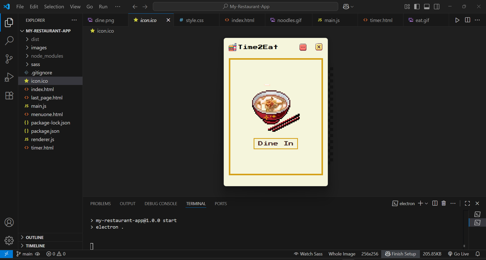
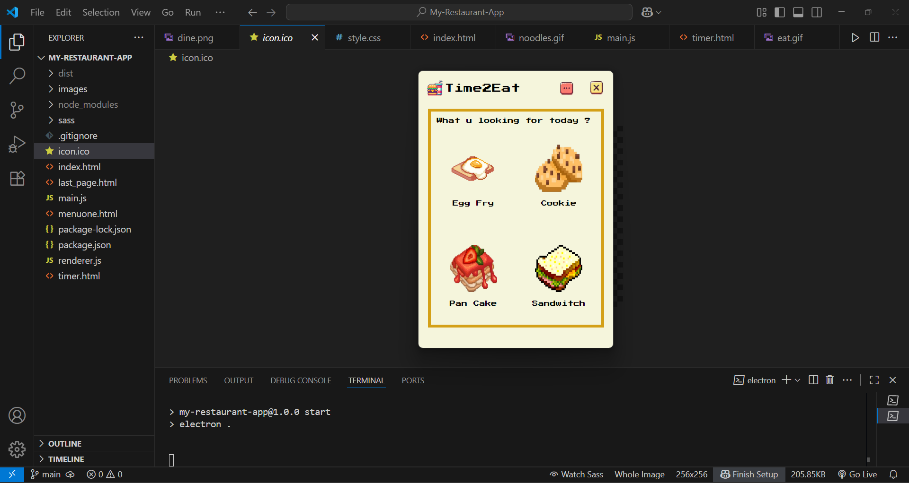
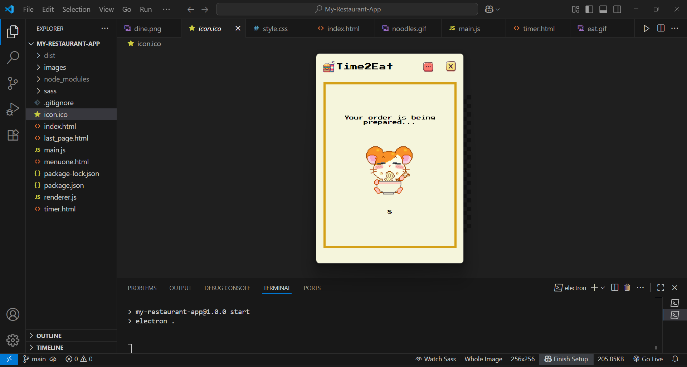
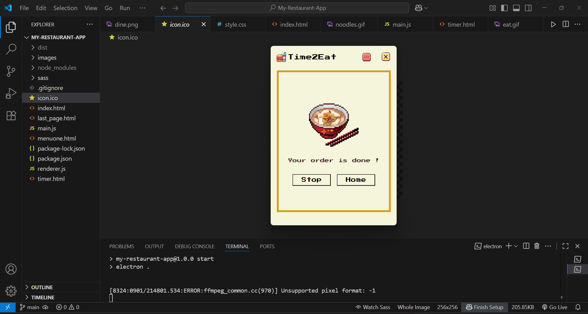

# Mini Restaurant App 🍽️  

A simple restaurant-themed desktop application built using **Electron.js**. It allows customers to place orders, track preparation time, and receive notifications when their food is ready.  

## Features  
- **Multi-Page Interface**: Includes four interactive pages for a smooth user experience.  
- **Food Selection**: Users can choose food items from a menu.  
- **Timer Section**: Displays estimated preparation time for the selected food.  
- **Order Notification**: Plays a beep sound when the order is ready.  

## Installation  
1. Download the latest release from the [GitHub Releases](https://github.com/Sherin-Jebamalar-M/My-Restaurant-App/releases).  
2. Extract the ZIP file and open the `Time2Eat.exe` file.  
3. Enjoy your restaurant experience!  

## Technologies Used  
- **Electron.js**  
- **HTML, CSS, JavaScript**

## 📸 Screenshots

### Home Page

### Menu Page

### Timer 

### Notification

## License  
This project is open-source and free to use.  
